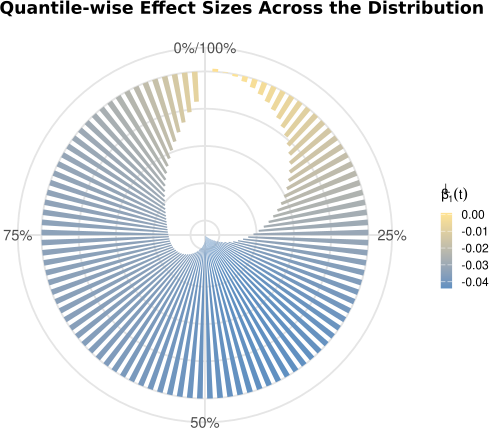

# WasserSpectrum

**WasserSpectrum** is an R toolkit for distribution-aware analysis of alpha diversity. It provides:

1. **Permutation Wasserstein tests** for group comparisons  
2. **Quantile-resolved spectrum regression** to reveal where distributions differ  
3. **Post-inference Wald-type tools** (global, interval-wise, and shape contrasts)

---

## Installation

```r
# If devtools is not installed:
install.packages("devtools")

devtools::install_github("bioscinema/WasserSpectrum")
```

---

## I. Wasserstein test for group comparison

**Goal:** Compare entire distributions (location/scale/shape) using 1D Wasserstein distance and barycenter geometry — robust to ties and skew common in microbiome data.

### `wasserstein_test`

Two-sample, permutation-based 1D Wasserstein test.

- **Inputs:** `df` (data.frame, one row per sample), `feature_col` (numeric feature such as Shannon index), `group_col` (factor/character with exactly two levels), `nperm`, `seed`, `plot`  

- **Outputs:** `statistic`, `p_value`, `null_distribution`  
- **Notes:** right-tailed p-value computed as `mean(T_null >= T_obs)`.

```r
# df: data.frame with one row per sample
# feature_col: numeric column with diversity index (e.g. Shannon)
# group_col: factor/character with exactly two levels

res2 <- wasserstein_test(df, "Shannon", "Group", nperm = 1000, seed = 1, plot = FALSE)
res2$statistic
res2$p_value
```

### `wasserstein_test_pairwise`

All pairwise two-sample tests across a multi-level `group_col`. Internally reuses `wasserstein_test()` on each pair.

- **Inputs:** `df` (data.frame, one row per sample), `feature_col` (numeric feature such as Shannon index), `group_col` (factor/character with ≥ 2 levels), `nperm`, `seed`, `pair_sep`  
- **Output:** `data.frame` with `comparison`, `statistic`, `p_value`

```r
# df: data.frame with one row per sample
# feature_col: numeric column with diversity index (e.g. Shannon)
# group_col: factor/character with ≥ 2 levels (multi-group)
# This function runs all pairwise Wasserstein tests across groups

pair_res <- wasserstein_test_pairwise(df, "Shannon", "Group", nperm = 2000, seed = 7)
pair_res[order(pair_res$p_value), ]
```

### `frechet_wasserstein_test`

Omnibus multi-group test (G > 2) using Fréchet variance in Wasserstein space (ANOVA analogue).  
Idea: compute group quantile functions on a grid, their Wasserstein barycenter, and the size-weighted sum of squared distances to that barycenter; generate a permutation null by shuffling group labels.

- **Inputs:** `df` (data.frame, one row per sample), `feature_col` (numeric feature such as Shannon index), `group_col` (factor/character with ≥ 3 levels), `nperm`, `seed`, `plot`  
- **Outputs:** `T_obs`, `p_value`, `T_null`

```r
# df: data.frame with one row per sample
# feature_col: numeric column with diversity index (e.g. Shannon)
# group_col: factor/character with ≥ 3 levels (multi-group)
# This function performs an omnibus test (ANOVA analogue) using Wasserstein Fréchet variance

fw <- frechet_wasserstein_test(df, "Shannon", "Group", nperm = 2000, seed = 42, plot = FALSE)
fw$T_obs
fw$p_value
```


---

## II. Spectrum analysis

**Goal:** Quantify where distributions differ along the quantile spectrum via GLS spectrum regression with B-spline basis expansion and robust (HC1) standard errors.

### `wasserstein_spectrum`

Binary or numeric exposure (optionally with confounders).

- **Inputs:**  
  `df` (data.frame, one row per sample), `feature_col` (numeric feature such as Shannon index), `outcome_col` (binary factor/character or numeric continuous), `confounder_cols = NULL` (optional covariates in df),  
  `basis_df = 6`, `t_grid = seq(0.01, 0.99, length.out = 100)`, `alpha = 0.05`, `plot = TRUE`, `seed`  
- **Outputs:**  
  `quantiles`, `beta1`, `se1`, `lower`, `upper`, `basis`, `coef`, `vcov`, `idx_x`, `basis_df`,  
  plus `lollipop_plot` and `circular_plot` for visualization.

```r
# df: data.frame with one row per sample
# feature_col: numeric column with diversity index (e.g. Shannon)
# outcome_col: binary (factor/character) or numeric continuous exposure
# confounder_cols: optional adjustment covariates (numeric or factor)
# basis_df: degrees of freedom for B-spline basis
# t_grid: quantile grid for spectrum estimation

fit_bin <- wasserstein_spectrum(
  df, feature_col = "Shannon", outcome_col = "BMI",
  confounder_cols = c("Age", "Sex"),
  basis_df = 6, alpha = 0.05, plot = TRUE, seed = 11
)
plot(fit_bin$quantiles, fit_bin$beta1, type = "l")
fit_bin$lollipop_plot
```




### `wasserstein_spectrum_multiclass`

Categorical exposure with K ≥ 2 levels; one level is set as reference. Returns group-vs-reference contrast curves βk(t) with CIs.

- **Inputs:**  
  `df` (data.frame, one row per sample),, `feature_col` (numeric feature such as Shannon index), `outcome_col` (categorical with K ≥ 2 levels), `reference_level` (must match a level of outcome_col), `confounder_cols = NULL` (optional covariates),  
  `basis_df = 6`, `t_grid`, `alpha`, `plot = TRUE`, `seed`  
- **Outputs:**  
  `quantiles`, `beta` (groups × quantiles), `se`, `lower`, `upper`,  
  `comparison_levels`, `reference_level`, `basis`, `coef`, `vcov`, and `plot` (faceted)

```r
# df: data.frame with one row per sample
# feature_col: numeric column with diversity index (e.g. Shannon)
# outcome_col: categorical factor/character with K ≥ 2 levels
# reference_level: one of levels(outcome_col); controls contrast direction
# confounder_cols: optional adjustment covariates (numeric or factor)
# basis_df: B-spline degrees of freedom; t_grid: quantile grid (optional)

fit_mc <- wasserstein_spectrum_multiclass(
  df, "Shannon", "DiseaseGroup",
  reference_level = "Healthy",
  confounder_cols = c("Age", "Sex"),
  basis_df = 6, plot = TRUE, seed = 29
)
fit_mc$comparison_levels
fit_mc$plot
```

---

## III. Post-inference tools

Wald-type tests on integrated or shape-based features of the estimated spectrum curves.

### `if_manova`

Global interval-wise MANOVA over [a,b]: tests whether all group-vs-reference integrated effects are zero.

- **Inputs:** `spectrum_obj = wasserstein_spectrum_multiclass(...)`, `a` (quantile lower bound), `b`  (quantile upper bound; 0 ≤ a < b ≤ 1 and within the model’s t_grid) 
- **Outputs:** `statistic`, `df`, `p_value`, `delta`, `cov_delta`

Definition (integrated effects): For each non-reference group k, the contrast curve β_k(t) is integrated over [a, b] to form

δ_k = ∫_a^b β_k(t) dt

(implemented as a Riemann sum over the internal t_grid). Collecting all groups,

δ = (δ_1, …, δ_m),   Σ = Cov(δ)

The Wald statistic is

T = δ^T Σ^{-1} δ

which is asymptotically χ²_m, where m is the number of non-reference groups.


```r
# a, b: quantile bounds in [0,1] with 0 ≤ a < b ≤ 1 (must lie within the model's t_grid).
# They index the Wasserstein quantile domain (NOT raw feature values).
# T statistic is a Wald test on integrated effects δ over [a,b].

global <- if_manova(fit_mc, a = 0.2, b = 0.8)
global$statistic
global$p_value
```

### `if_manova_contrast`

User-specified contrast(s) over [a,b] (pairwise or composite).

- **Inputs:** `spectrum_obj` (result object from wasserstein_spectrum_multiclass(...)), `a` , `b` (quantile bounds (0 ≤ a < b ≤ 1, within the model’s t_grid)), `contrast` user-specified vector or matrix defining linear contrasts across groups (rows summing to 0 recommended; e.g., c(1, -1, 0) = group1 vs group2).  
- **Outputs:** `statistic`, `df`, `p_value`, `contrast`, `estimate`, `cov_estimate`

Definition (contrast-integrated effects): For each group-vs-reference curve β(t), 
form the integrated effect over [a,b]:

δ = ∫_a^b β(t) dt

Given a contrast vector (or matrix) C, the contrast estimate is

Δ = C δ,    Cov(Δ) = C Σ Cᵀ

The Wald statistic is

T = Δᵀ (Cov(Δ))⁻¹ Δ

which is asymptotically χ²_r, where r = rank(C).


```r
# a, b: quantile bounds in [0,1], must lie within the model's t_grid
# contrast: vector or matrix of group weights (rows sum to 0 recommended)
# Example: (1, -1, 0) = test group1 vs group2, ignoring group3

pw <- if_manova_contrast(fit_mc, a = 0.2, b = 0.8, contrast = c(1, -1, 0))
pw$p_value
```

### `quantile_FLT`

Functional Linear Test for a single curve (e.g., β1(t) from `wasserstein_spectrum`) integrated over [a,b].

- **Inputs:** `spectrum_obj = wasserstein_spectrum(...)`, `a`, `b`  
- **Outputs:** `delta` (integral), `se`, `z`, `p` (two-sided)

Definition (single-curve integrated effect): Let β(t) be the estimated spectrum curve
(e.g., β₁(t) from `wasserstein_spectrum`). The integrated effect over [a,b] is

δ = ∫ₐᵇ β(t) dt

Its variance is estimated from the model’s covariance of β(t), yielding

se = sqrt( Var(δ) )

The Wald statistic and two-sided p-value are

z = δ / se
p = 2 * Φ( -|z| )

```r
# a, b: quantile bounds in [0,1]; must lie within the model's t_grid.
# Tests H0: ∫_a^b β(t) dt = 0 for a single curve (e.g., β1 from wasserstein_spectrum).


flt <- quantile_FLT(fit_bin, a = 0.25, b = 0.75)
with(flt, c(delta = delta, se = se, z = z, p = p))
```

### `shape_contrast_test`

Shape-aware testing using quantile weights (`contrast_t`) and group contrasts — ideal for U-shape vs shift comparisons.

- **Inputs:**  
  `spectrum_obj = wasserstein_spectrum_multiclass(...)`,  
  `t_vec`, `contrast_t` (should sum to ~0 for pure shape),  
  `contrast_group` (optional; rows sum to 0 recommended)  
- **Outputs:**  
  `statistic`, `df`, `p_value`, `delta_shape`, `cov_shape`,  
  `contrast_group`, `estimate`, `cov_estimate`

Definition (shape contrast): For each group-vs-reference spectrum curve β(t), 
first compute the shape-weighted integral

δ_shape = Σ_j contrast_t[j] · β(t_vec[j])

Given a group contrast C, the contrast estimate is

Δ = C δ_shape,    Cov(Δ) = C Σ_shape Cᵀ

The Wald statistic is

T = Δᵀ (Cov(Δ))⁻¹ Δ

which is asymptotically χ²_r, where r = rank(C).


```r
# t_vec: selected quantile grid points in [0,1]
# contrast_t: weights applied to β(t) at t_vec (should sum to ~0 for pure shape tests)
# Example below: U-shape contrast (high-low-high pattern)
# contrast_group: group contrast vector; (1, -1, 0) = group1 vs group2

t_vec <- seq(0.1, 0.9, length.out = 5)
contrast_t <- c(1, -0.5, -1, -0.5, 1)
shape <- shape_contrast_test(
  spectrum_obj = fit_mc,
  t_vec = t_vec, contrast_t = contrast_t,
  contrast_group = c(1, -1, 0)
)
shape$statistic
shape$p_value
```

---

